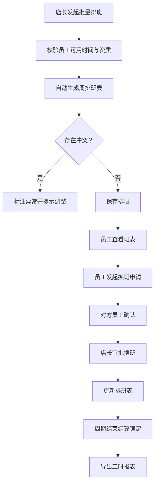

## 1. 产品概述

连锁门店班次与临时换班系统，面向连锁零售/餐饮行业，解决多门店排班管理、员工换班、工时统计等核心痛点。支持店长按门店维护岗位、营业时段和员工可用时间，自动生成周排班表，允许员工线上发起换班申请并追踪审批流程。

- 目标用户：门店店长、门店员工、区域管理员
- 核心价值：减少排班人工成本、避免排班冲突、规范换班流程、精准统计工时

## 2. 核心功能

### 2.1 用户角色

| 角色 | 注册方式 | 核心权限 |
|------|---------|---------|
| 店长 | 系统录入 | 维护门店/岗位/时段、批量生成排班、审批换班、记录缺勤、结算锁定、工时导出 |
| 员工 | 系统录入 | 查看个人班表、发起换班申请、确认/拒绝换班、查看工时统计 |
| 管理员 | 系统录入 | 跨店借调配置、全门店数据查看、导出历史审计 |

### 2.2 功能模块

1. **门店日历页**：周视图排班展示、批量生成、单日调整、缺勤记录、结算状态标记
2. **个人班表页**：员工周班表查看、换班入口、工时汇总
3. **待确认换班页**：发起换班、对方确认、店长审批、状态追踪
4. **工时统计与导出页**：按门店/岗位/员工维度统计、异常班次标注、CSV导出、导出历史
5. **基础数据维护页**：门店管理、岗位管理、营业时段、员工资质与可用时间配置

### 2.3 页面详情

| 页面名称 | 模块名称 | 功能描述 |
|---------|---------|---------|
| 门店日历页 | 周视图排班表 | 按门店展示一周7天×时段的排班网格，支持拖拽调整班次 |
| 门店日历页 | 批量生成排班 | 选择周次和门店，基于员工可用时间和资质自动生成排班 |
| 门店日历页 | 单日调整 | 修改指定日期的班次分配，实时校验冲突 |
| 门店日历页 | 缺勤与补班 | 记录员工缺勤，安排补班并关联原班次 |
| 门店日历页 | 结算锁定 | 对已结算班次加锁，锁定后只读不可修改 |
| 个人班表页 | 周班表展示 | 展示当前员工本周及历史班次 |
| 个人班表页 | 换班申请入口 | 从班表直接发起换班，选择目标班次 |
| 个人班表页 | 工时汇总 | 展示本周/本月已排班工时、实际工时、异常工时 |
| 待确认换班页 | 换班列表 | 展示我发起的、待我确认的、已完成的换班申请 |
| 待确认换班页 | 发起换班 | 选择自己的班次和目标员工/班次，提交申请 |
| 待确认换班页 | 确认换班 | 对方员工确认/拒绝，店长最终审批 |
| 工时统计与导出页 | 多维度统计 | 按门店、岗位、员工筛选统计工时数据 |
| 工时统计与导出页 | 异常班次标注 | 高亮资质不匹配、工时超限、跨店冲突等异常 |
| 工时统计与导出页 | CSV导出 | 导出包含门店、岗位、异常、结算状态的工时报表 |
| 工时统计与导出页 | 导出历史 | 记录每次导出操作，支持下载历史文件 |
| 基础数据维护页 | 门店管理 | 新增/编辑门店信息、营业时段配置 |
| 基础数据维护页 | 岗位管理 | 维护岗位名称、所需资质 |
| 基础数据维护页 | 员工管理 | 维护员工信息、所属门店、资质证书、可上班时间 |

## 3. 核心流程

### 3.1 排班生成流程
店长选择目标门店和周次 → 系统校验基础数据完整性 → 基于员工可用时间、资质、工时上限自动匹配生成排班 → 展示排班结果并标注冲突 → 店长手动调整 → 确认保存。

### 3.2 换班申请流程
员工发起换班（选择自己班次+目标员工）→ 系统校验（资质匹配、工时不超限、班次未锁定）→ 对方员工收到通知 → 对方确认/拒绝 → 确认后店长审批 → 审批通过自动更新排班表。

### 3.3 工时结算流程
店长进入结算周期 → 核对考勤异常（缺勤、补班、换班）→ 确认工时数据 → 点击结算锁定 → 锁定后该周期班次变为只读 → 可导出结算报表。

## 4. 用户界面设计

### 4.1 设计风格
- **主色调**：深海蓝 #1e3a5f 作为品牌主色，搭配青蓝 #3b82f6 作为强调色
- **辅助色**：琥珀橙 #f59e0b 标记待确认，翠绿 #10b981 标记正常，玫红 #ef4444 标记异常/冲突
- **背景色**：冷灰渐变背景 #f8fafc → #eef2f7，卡片使用纯白带微阴影
- **按钮风格**：圆角 8px，主按钮为实心蓝，次要按钮为描边蓝
- **字体**：标题使用"思源宋体"展示稳重感，正文使用"PingFang SC"保证可读性
- **布局风格**：左侧导航栏 + 顶部面包屑 + 主内容卡片化布局
- **图标风格**：使用 Lucide 线性图标，保持简洁专业

### 4.2 页面设计概览

| 页面名称 | 模块名称 | UI元素 |
|---------|---------|---------|
| 门店日历页 | 周视图排班表 | 时间轴横向网格、班次色块、拖拽手柄、悬浮冲突提示气泡 |
| 门店日历页 | 操作工具栏 | 周次切换器、门店下拉、批量生成按钮、锁定状态标签 |
| 个人班表页 | 周班表卡片 | 日历卡片布局、班次时段标签、换班按钮、工时进度条 |
| 待确认换班页 | 换班列表 | 状态标签页、换班卡片、操作按钮组、时间线审批流 |
| 工时统计与导出页 | 数据看板 | 统计数字卡片、异常列表、导出按钮、历史记录表 |
| 基础数据维护页 | 配置表单 | 分组Tab、表单输入框、资质多选、时间选择器 |

### 4.3 响应式
桌面端优先设计，采用 1440px 基准栅格。平板端（1024px）侧边栏折叠为图标模式，移动端（768px）采用底部Tab导航，排班表转为按天卡片堆叠展示。

### 4.4 动画与交互
- 排班表加载采用淡入 + 错位动画
- 换班状态变更使用侧边滑入提示条
- 锁定/解锁操作有确认模态框 + 状态翻转微动画
- 异常班次使用呼吸灯效果吸引注意
