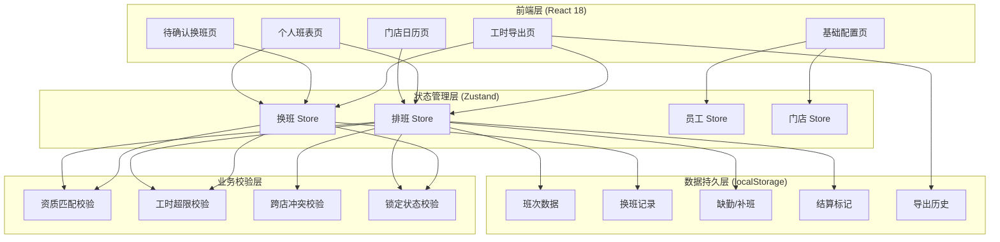
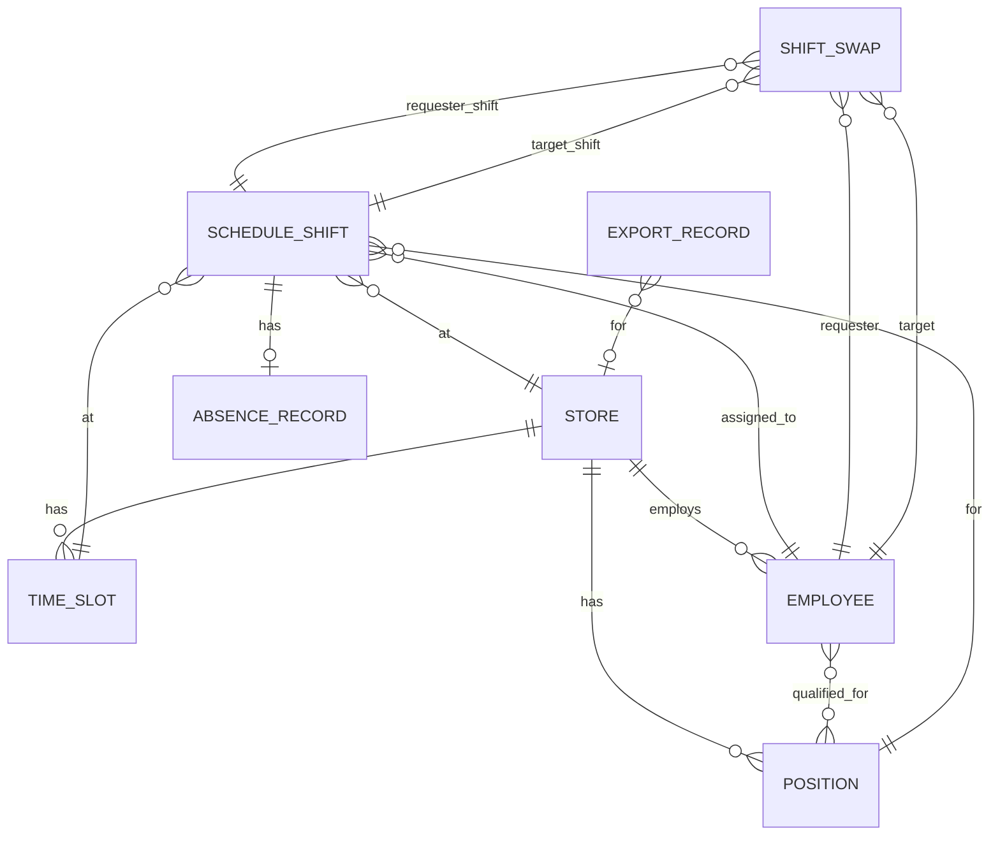

## 1. 架构设计



## 2. 技术说明

- **前端框架**：React@18 + TypeScript@5 + Vite@5
- **样式方案**：TailwindCSS@3 + CSS Variables
- **状态管理**：Zustand@4（轻量级状态管理，支持中间件持久化）
- **数据持久化**：localStorage（zustand-persist 中间件）
- **图标库**：Lucide React
- **日期处理**：date-fns
- **UI组件**：自主开发（Modal、Toast、Table、Tabs、Badge）
- **导出功能**：原生 CSV 生成 + Blob 下载
- **无后端设计**：纯前端 SPA，所有数据存储于 localStorage，重启可复查

## 3. 路由定义

| 路由 | 页面名称 | 访问角色 | 说明 |
|------|---------|---------|------|
| / | 门店日历（首页） | 店长/员工/管理员 | 默认展示当前门店本周排班 |
| /my-schedule | 个人班表 | 员工/店长 | 查看个人班次和发起换班 |
| /shift-swaps | 待确认换班 | 店长/员工 | 换班申请列表与审批 |
| /reports | 工时统计与导出 | 店长/管理员 | 工时看板与CSV导出 |
| /settings | 基础数据配置 | 店长/管理员 | 门店、岗位、员工配置 |

## 4. 核心类型定义

```typescript
// 门店
interface Store {
  id: string;
  name: string;
  address: string;
  businessHours: {
    start: string; // "09:00"
    end: string;   // "22:00"
  };
  shifts: TimeSlot[];
}

// 时段
interface TimeSlot {
  id: string;
  name: string;      // "早班"
  startTime: string; // "09:00"
  endTime: string;   // "14:00"
}

// 岗位
interface Position {
  id: string;
  name: string;
  requiredQualifications: string[];
  storeId: string;
}

// 员工
interface Employee {
  id: string;
  name: string;
  storeId: string;
  positionIds: string[];
  qualifications: string[];
  availableTimes: {
    [dayOfWeek: number]: string[]; // 0-6, ["09:00-14:00", "18:00-22:00"]
  };
  maxWeeklyHours: number;
  maxConsecutiveDays: number;
}

// 排班班次
interface ScheduleShift {
  id: string;
  storeId: string;
  employeeId: string;
  positionId: string;
  date: string;        // "2026-06-20"
  timeSlotId: string;
  startTime: string;
  endTime: string;
  isAbsent: boolean;
  makeupShiftId?: string;
  isSettled: boolean;
  settledAt?: string;
  anomalies: string[]; // ["qualification_mismatch", "hours_over_limit"]
  isBorrowed?: boolean;
  sourceStoreId?: string;
}

// 换班申请
interface ShiftSwap {
  id: string;
  requesterId: string;
  targetEmployeeId: string;
  requesterShiftId: string;
  targetShiftId: string;
  status: "pending_confirmation" | "confirmed" | "rejected" | "approved" | "cancelled";
  requestedAt: string;
  confirmedAt?: string;
  approvedAt?: string;
  rejectReason?: string;
}

// 缺勤记录
interface AbsenceRecord {
  id: string;
  shiftId: string;
  employeeId: string;
  date: string;
  reason: string;
  makeupShiftId?: string;
  recordedAt: string;
}

// 导出历史
interface ExportRecord {
  id: string;
  type: "weekly_hours" | "anomaly_report";
  storeId?: string;
  startDate: string;
  endDate: string;
  exportedAt: string;
  exportedBy: string;
  fileName: string;
  rowCount: number;
}
```

## 5. 数据模型 ER 图



## 6. 业务校验规则

### 6.1 排班校验
- **资质不匹配**：员工 qualifications 不包含岗位 requiredQualifications → 标记 anomaly
- **连续工时超限**：单日跨班次合计超过8小时或每周超过 maxWeeklyHours → 错误提示
- **同一时间多店排班**：员工同时段在多 store 有排班 → 错误提示
- **可用时间冲突**：排班时段不在员工 availableTimes 内 → 警告提示

### 6.2 换班校验
- **换班对方未确认**：status = pending_confirmation 时禁止审批通过
- **已结算班次被修改**：isSettled = true 的班次禁止换班/调整 → 明确错误
- **资质校验**：换班后双方资质仍需匹配目标岗位

### 6.3 结算锁定
- 结算后班次 isSettled = true，所有编辑操作返回错误
- 导出时包含结算状态字段，已结算标记为"已锁定"

## 7. 验收测试用例映射

| 验收场景 | 覆盖模块 | 验证点 |
|---------|---------|-------|
| 批量生成排班 | 门店日历 → 批量生成 | 基于可用时间自动生成，资质/工时校验生效 |
| 单日调整 | 门店日历 → 单日编辑 | 拖拽或编辑班次，实时校验冲突 |
| 跨店借调 | 排班 + 员工配置 | isBorrowed 标记，校验不与原店排班冲突 |
| 结算锁定只读 | 工时导出 → 结算 | 锁定后编辑按钮禁用，操作返回明确错误 |
